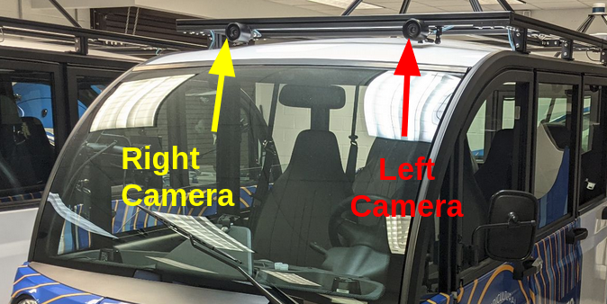

# Speed Controller with Object Detection based on Autoware



In this project, I used two forward-facing cameras (left and right) to detect objects in front of the ego vehicle and stop it when necessary.

## Demo Video

### Speed Controller with YOLOX Detection in Action

[](https://youtu.be/GCaL9vF5LtY)

[Watch Full Demo on YouTube](https://youtu.be/GCaL9vF5LtY)


## Project Story

This autonomous safety system combines dual camera vision with intelligent object detection:
- **Dual Camera Setup**: Left (FL) and right (FR) forward-facing cameras provide a comprehensive field of view
- **YOLOX Detection**: Real-time object detection identifies pedestrians, vehicles, and obstacles
- **Smart Fusion**: Overlapping detections from both cameras are merged to eliminate duplicates and improve accuracy
- **Automatic Safety**: Vehicle automatically stops when objects are detected in the trajectory path
- **Autoware Integration**: Seamlessly integrates with Autoware's planning system for autonomous driving


## Key Features

- Object Detection: Real-time YOLOX detection of pedestrians, cars, and obstacles
- Dual Camera Fusion: Combines FL and FR camera detections with IoU-based overlap detection
- Automatic Safety Stop: Emergency stop when objects are detected in the trajectory path
- Pedestrian Safety: Immediate stop for pedestrians on lane boundaries
- Autoware Integration: Integration with Autoware trajectory planning

### 1. Build Package
```bash
cd ~/autoware_ws
colcon build --packages-select speed_controller_cpp
source install/setup.bash
```

### 2. Single Camera Mode 
```bash
# Launch YOLOX detection
ros2 launch tensorrt_yolox yolox.launch.xml

# Launch speed controller
ros2 launch speed_controller_cpp speed_controller.launch.py
```

### 3. Dual Camera Mode 
```bash
# Terminal 1: FL camera
ros2 launch tensorrt_yolox yolox.launch.xml input_topic:=/sensing/camera/camera0/image_raw output_topic:=/perception/object_recognition/detection/rois0

# Terminal 2: FR camera
ros2 launch tensorrt_yolox yolox.launch.xml input_topic:=/sensing/camera/camera1/image_raw output_topic:=/perception/object_recognition/detection/rois1

# Terminal 3: Speed controller with fusion
ros2 launch speed_controller_cpp speed_controller.launch.py enable_dual_camera:=true
```
### Detection Fusion
- Single Object: Car detected by both cameras gets fused into one accurate detection
- Unique Objects: Objects seen by only one camera are preserved
- Result: Reduces false counts and improves detection accuracy

### Safety Scenarios
1. Object in Path: Vehicle stops when any object is detected in the trajectory
2. Pedestrian on Lane: Immediate stop for pedestrians near lane boundaries  
3. Emergency Override: Manual emergency stop always available

## Manual Control
```bash
# Set speed
ros2 topic pub /speed_command std_msgs/msg/Float64 "data: 5.0"

# Stop vehicle
ros2 topic pub /speed_command std_msgs/msg/Float64 "data: 0.0"

# Emergency stop
ros2 topic pub /speed_command std_msgs/msg/Float64 "data: -1.0"
```

## Dependencies
- ROS2 Humble
- Autoware.universe
- TensorRT YOLOX package
- OpenCV 4.x

## Architecture
```
Camera(s) → YOLOX Detection → Object Analysis → Speed Control → Autoware Trajectory
```
